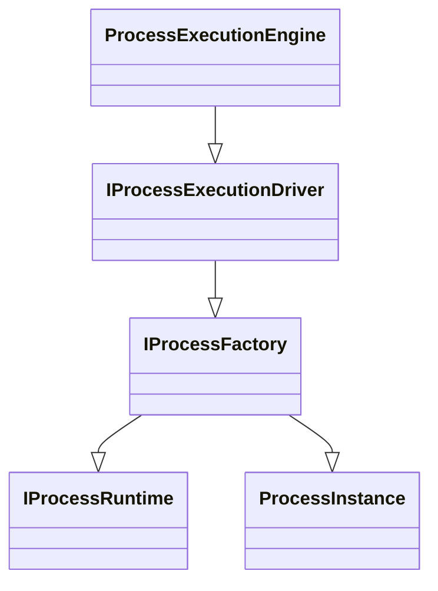

# ASOU Readme

ASOU is acronym for Another yet Service Orchestration Utility.

Introducing our open source project called ASOU, the BPMN Flow Management Tool. ASOU is designed to help developers
focus on writing individual steps for their applications, rather than spending time and effort coding all step
transitions, persistence, fault tolerance, etc. Our tool takes care of these difficult tasks for the developer,
providing an easy-to-use and intuitive interface for managing BPMN flows. By using this tool, developers can improve
code maintenance and decrease code complexity, allowing them to focus on creating high-quality and reliable
applications.

This project is open-source and available for anyone to use and contribute to, we are looking forward to contributions
from community.

By using this tool, developers can create applications that are more maintainable, more reliable, and easier to update,
which will ultimately lead to better user experiences.

## Engine

One of the unique features of this project is its switchable engine, which allows developers to choose between different
engines to suit their specific needs. For simple processes, we offer a fast graph-based engine that can be described
directly in the developer's code. This means that the developer doesn't need to deal with BPMN process description
storage and other complexities.

For more difficult and often-changing processes, we offer a fully-featured BPMN engine with a visual process editor.
This allows developers to create, test, and manage complex BPMN processes with ease.

## The basics of process

Business Process Model and Notation (BPMN) is a visual language for describing business processes. It is a standardized
notation that is used to model and analyze business processes in a graphical way. The BPMN flow is the sequence of
activities that are performed in a business process, and how they are connected to each other. These activities can
include things like tasks that need to be completed, decisions that need to be made, and events that occur.

## Quick start

Describe your process

```csharp
public class SampleProcessDefinition : IProcessDefinition
{
    public Guid Id => new("c380b7f4-2a76-44fc-9d5d-ecc7c105969b");
    public Guid VersionId => new("2a8038b9-921e-4aaa-a72d-f85d6ff512e8");
    public int Version => 1;
    public string Name => "SampleProcess";

    public void Describe(GraphProcessContract builder)
    {
        builder.StartFrom<DoSimpleStep>()
            .WithParameter<DoSimpleStep, string>("Parameter1",
                instance => (string)instance.ProcessRuntime.Parameters["Parameter1"]!,
                (instance, value) => instance.ProcessRuntime.Parameters["Parameter1"] = value)
            .WithParameter<DoSimpleStep, string>("Parameter2",
                setter: (instance, value) => instance.ProcessRuntime.Parameters["Parameter2"] = value)
            .Then<AsynchronousResumeStep>()
            .Then<ConditionalStep>();

        builder.Conditional<ConditionalStep, EndStep>("ToExit");
        builder.Conditional<ConditionalStep, DoSimpleStep>("TryAgain");
    }
}
```

Execute

```csharp
app.MapPost("/", async (ProcessExecutionEngine processExecutionEngine, CancellationToken cancellationToken) =>
{
    var timer = Stopwatch.StartNew();
    var result = await processExecutionEngine.ExecuteAsync(new Guid("c380b7f4-2a76-44fc-9d5d-ecc7c105969b"),
        new ProcessParameters { { "Parameter1", "Hello World" }, { "Parameter2", "" } }, cancellationToken);
    timer.Stop();
    result["ElapsedMilliseconds"] = timer.ElapsedMilliseconds;
    return result;
});
```

## How it works

### Process instance creation



### And all together

## Contribution

Our open source project is maintained by a small team of developers, but we are always looking for new members to join
us and help improve the project. There are many ways to contribute to the project, including:

- Reporting bugs and providing feedback on the tool
- Submitting bug fixes or feature enhancements
- Writing documentation or tutorials
- Helping to answer questions from other users on our community forums
- Spread the word about the project and help to increase its visibility

To communicate with the team, you can open an issue in our GitHub repository. The team will review it and respond to it
as soon as possible.

We welcome contributions of all kinds, whether you are an experienced developer or just getting started. We believe that
everyone has something valuable to contribute, and we are always happy to work with new contributors to help them get
started and make their first contributions. If you have any questions or need help getting started, please don't
hesitate to reach out to us. We are excited to see what you can bring to the project!

## Current state of project

Please note that this project is currently under active development and is not yet ready for production use. While we
are working hard to make it stable and functional, there may be bugs and unfinished features. There are currently no
releases available and the codebase is subject to change.

Features / milestones

- [x]  Conditional transitions
- [x]  Parameter binding
- [x]  Event subsystem and asynchronous resume support
- [x]  Process execution and data persistence on restart or failure
- [ ]  Reduce code complexity and rewrite proof of concept code (like Graph engine)
- [ ]  Validate running app in horizontal scaling environment (another instance of app can take event and resume
  process)
- [ ]  Source generator for step parameter binding
- [ ]  BPMN flow designer
- [ ]  BPMN engine. Extend Graph base engine to export BPMN flow to graph contract.
- [ ]  ContextCall bindings

If you are interested in testing out the project or would like to contribute, we welcome you to do so by checking out
our development branch. We appreciate your patience as we work to improve and stabilize the project.

# CI/CD

Section WIP.

# Change Log

All changes described in [CHANGELOG.md](./CHANGELOG.md)

# Guarantee and Security

This project is not covered by the security advisory policy. Use at your own risk.

# License

License described in [LICENSE.md](./LICENSE.md)
